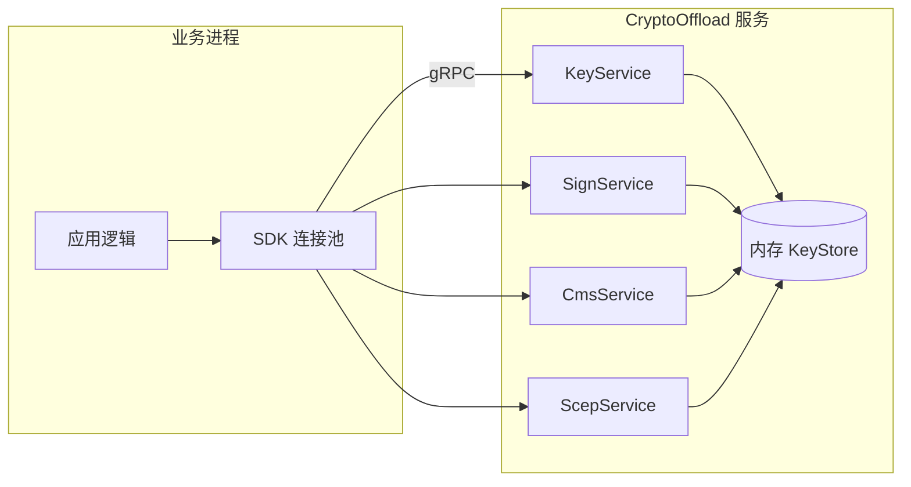
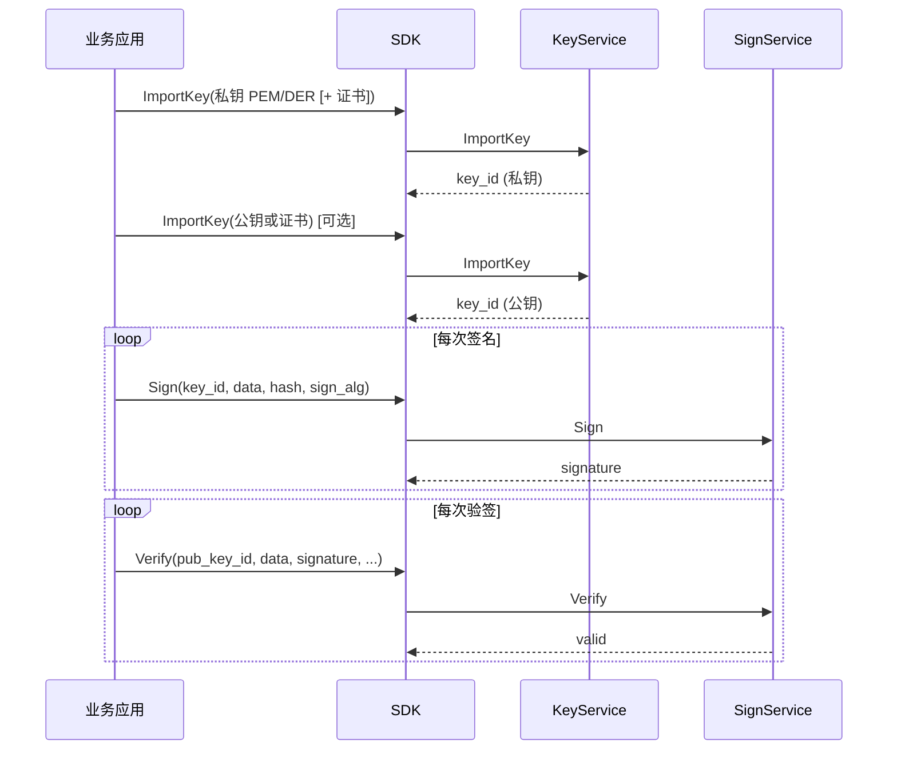
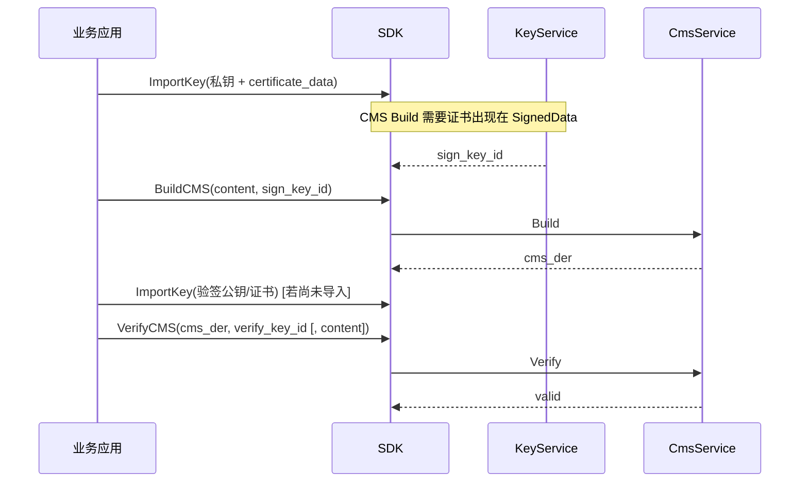
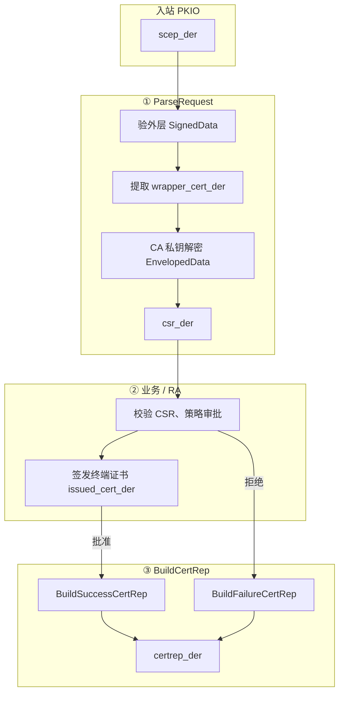
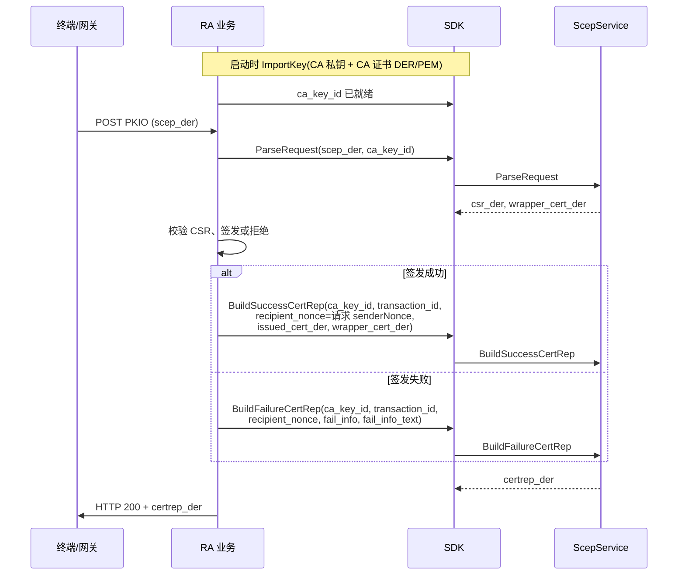
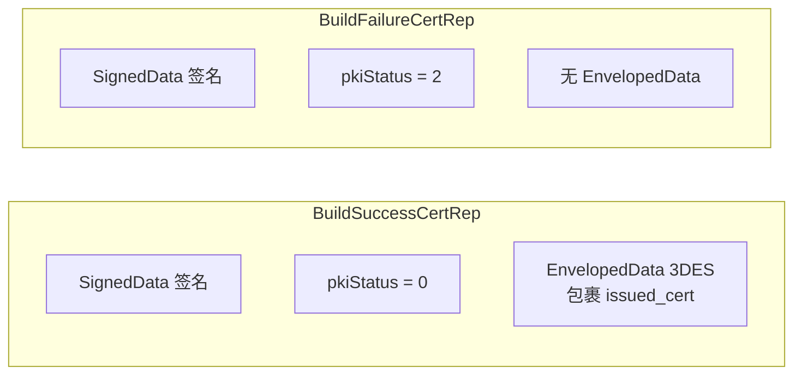
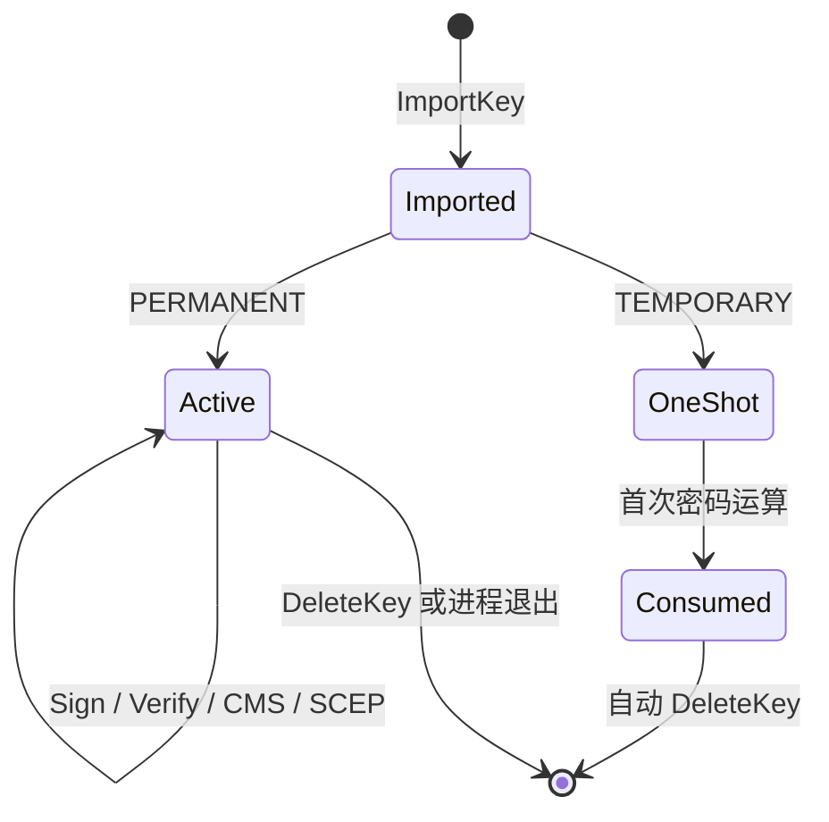

# CryptoOffload API 参考文档

> 版本：`cryptooffload.v1`  
> 传输：gRPC（Protobuf）  
> 默认地址：`127.0.0.1:50051`  
> 单字段大小上限：**1 MiB**（面向小包场景）

**文档结构**：§1 集成总览与流程图 → §2 公共枚举 → §3–6 各服务 RPC 详情 → §7 排错 → §8–11 运维与 Demo。

---

## 1. 概述

### 1.1 服务列表

| 服务 | 说明 |
|------|------|
| `KeyService` | 密钥导入/删除/查询（类 KMS，返回 `key_id`） |
| `SignService` | 数据签名与验签（通过 `key_id` 引用密钥） |
| `CmsService` | CMS/PKCS#7 解析、封装、验签 |
| `ScepService` | SCEP PKIO 解析与 CertRep 构建（RFC 8894） |

### 1.2 架构与职责边界

业务进程（Go/Java 等）持有 PEM/DER 密钥材料，**仅在启动或轮换时**通过 gRPC 导入；日常密码运算只传 `key_id` 与小包数据。



| 职责 | 业务侧 | Offload 侧 |
|------|--------|------------|
| 密钥持久化、轮换策略 | ✓ | 仅进程内内存缓存 |
| 小包签名/验签 | 调 RPC | OpenSSL 运算 |
| CMS 构建/解析/验签 | 调 RPC | OpenSSL 运算 |
| SCEP PKIO 解析、CertRep 构建 | 调 RPC；RA 签发证书 | PKCS#7 + 3DES Envelop |
| 大包/流式数据 | 自行分片或哈希后传入 | 单字段 ≤ 1 MiB |

### 1.3 集成流程一览

#### 1.3.1 签名 / 验签（SignService）



**持久化建议**：业务库只存 `key_id` + `label`，不存 PEM；服务重启后按 label 重新 ImportKey。

#### 1.3.2 CMS 签名与验签（CmsService）



| 场景 | `detached` | `VerifyCMS.content` |
|------|------------|---------------------|
| Attached（内容在 CMS 内） | `false` | 可空 |
| Detached（内容与签名分离） | `true` | 必须传原始 `content` |

#### 1.3.3 SCEP 证书签发（ScepService）

典型 RA/CA 场景：终端发来 **PKIO**（外层 SignedData + 内层 EnvelopedData），业务解密 CSR、签发证书后返回 **CertRep**。





**Nonce 对应关系（RFC 8894）**

| 请求字段 | 写入 CertRep | 说明 |
|----------|--------------|------|
| `transactionID` | 同值回写 | 必须与请求一致 |
| `senderNonce`（请求） | `recipientNonce`（响应） | 填 `Build*CertRep.recipient_nonce` |
| — | `senderNonce`（响应） | `sender_nonce` 空则服务端生成 16 字节随机数 |

**SUCCESS vs FAILURE 结构差异**



> **wrapper_cert_der 必填（SUCCESS）**：EnvelopedData 的接收方证书；即使 wrapper 为 Ed25519，加密仍按 SCEP 惯例使用 CA RSA 公钥。

#### 1.3.4 密钥生命周期



### 1.4 算法与参数速查

| 密钥类型 | 推荐 `sign_algorithm` | `hash_algorithm` | 备注 |
|----------|----------------------|------------------|------|
| RSA | `SIGN_RSA_PKCS1_V15` 或 `SIGN_RSA_PSS` | `HASH_SHA256` 等 | PSS 时 hash 参与 MGF |
| EC (P-256 等) | `SIGN_ECDSA`（可省略，自动推断） | `HASH_SHA256` 等 | |
| SM2 | `SIGN_SM2` | `HASH_SM3`（可省略，默认 SM3） | 需 OpenSSL 国密支持 |
| Ed25519 | `SIGN_ED25519` | **`HASH_ALGORITHM_UNSPECIFIED`（0）** | 禁止传 SHA 系列 |

`sign_algorithm` / `hash_algorithm` 传 `UNSPECIFIED` 时，服务端按密钥类型推断（见 §2.5）。

### 1.5 SDK 方法对照

| gRPC RPC | Go | Python | Rust | Java |
|----------|-----|--------|------|------|
| `KeyService.ImportKey` | `ImportKey` | `import_key` | `import_key` | `importKey` |
| `KeyService.DeleteKey` | `DeleteKey` | `delete_key` | `delete_key` | `deleteKey` |
| `SignService.Sign` | `Sign` | `sign` | `sign` | `sign` |
| `SignService.Verify` | `Verify` | `verify` | `verify` | `verify` |
| `CmsService.Build` | `BuildCMS` | `build_cms` | `build_cms` | `buildCms` |
| `CmsService.Parse` | `ParseCMS` | `parse_cms` | `parse_cms` | `parseCms` |
| `CmsService.Verify` | `VerifyCMS` | `verify_cms` | `verify_cms` | `verifyCms` |
| `ScepService.ParseRequest` | `ParseScepRequest` | `parse_scep_request` | `parse_scep_request` | `parseScepRequest` |
| `ScepService.BuildSuccessCertRep` | `BuildScepSuccessCertRep` | `build_scep_success_cert_rep` | `build_scep_success_cert_rep` | `buildScepSuccessCertRep` |
| `ScepService.BuildFailureCertRep` | `BuildScepFailureCertRep` | `build_scep_failure_cert_rep` | `build_scep_failure_cert_rep` | `buildScepFailureCertRep` |

连接池：Go `client.New` / Python `CryptoOffloadClient` / Rust `Client::connect` / Java `CryptoOffloadClient.connect`。

### 1.6 密钥存储模型（重要）

**ImportKey 时服务端会一次性完成解析并缓存在内存中**，后续 Sign/Verify/CMS 只通过 `key_id` 取用已解析的 OpenSSL 对象：

| 导入格式 | ImportKey 时做什么 | 后续运算 |
|----------|-------------------|----------|
| PEM | Base64 解码 + ASN.1 解析 → `PKey` / `X509` | **不再**重复 PEM 解析 |
| DER | ASN.1 解析 → `PKey` / `X509` | **不再**重复 DER 解析 |

- **不是磁盘持久化**：密钥仅存在服务端进程内存，重启后需重新 ImportKey
- **永久密钥** (`KEY_LIFETIME_PERMANENT`)：可多次运算，内存中保留同一份 `PKey`
- **临时密钥** (`KEY_LIFETIME_TEMPORARY`)：首次用于 Sign/Verify/CMS 后自动从内存删除

---

## 2. 公共枚举与消息

### 2.1 KeyKind — 密钥种类

| 值 | 名称 | 说明 |
|----|------|------|
| 0 | `KEY_KIND_UNSPECIFIED` | 未指定（非法） |
| 1 | `KEY_KIND_PRIVATE` | 私钥：可用于 Sign、CMS Build、CMS Decrypt |
| 2 | `KEY_KIND_PUBLIC` | 公钥：可用于 Verify |
| 3 | `KEY_KIND_CERTIFICATE` | 证书：提取公钥，可用于 Verify、CMS Verify |

### 2.2 KeyLifetime — 密钥生命周期

| 值 | 名称 | 说明 |
|----|------|------|
| 0 | `KEY_LIFETIME_UNSPECIFIED` | 未指定（非法） |
| 1 | `KEY_LIFETIME_PERMANENT` | 永久：服务运行期间可重复使用 |
| 2 | `KEY_LIFETIME_TEMPORARY` | 临时：首次密码运算后销毁 |

### 2.3 KeyFormat — 密钥编码

| 值 | 名称 | 说明 |
|----|------|------|
| 0 | `KEY_FORMAT_UNSPECIFIED` | 未指定（非法） |
| 1 | `KEY_FORMAT_DER` | DER 二进制 |
| 2 | `KEY_FORMAT_PEM` | PEM 文本（含 `BEGIN/END` 头） |

### 2.4 HashAlgorithm — 摘要算法

用于 Sign/Verify：服务端对 `data` 做摘要后再签名/验签。

| 值 | 名称 | OpenSSL 等价 |
|----|------|--------------|
| 0 | `HASH_ALGORITHM_UNSPECIFIED` | 非法 |
| 1 | `HASH_SHA256` | SHA-256 |
| 2 | `HASH_SHA384` | SHA-384 |
| 3 | `HASH_SHA512` | SHA-512 |
| 4 | `HASH_SHA1` | SHA-1（遗留场景） |
| 5 | `HASH_SM3` | SM3（国密，SM2 默认摘要） |

> 不提供独立的 Hash RPC；摘要运算是签名流程的内置步骤。

### 2.5 SignAlgorithm — 签名算法

| 值 | 名称 | 说明 |
|----|------|------|
| 0 | `SIGN_ALGORITHM_UNSPECIFIED` | 由服务端按密钥类型推断 |
| 1 | `SIGN_RSA_PKCS1_V15` | RSA PKCS#1 v1.5 |
| 2 | `SIGN_RSA_PSS` | RSA-PSS |
| 3 | `SIGN_ECDSA` | ECDSA（P-256 等椭圆曲线） |
| 4 | `SIGN_SM2` | 国密 SM2（摘要须 SM3，默认 SM3） |
| 5 | `SIGN_ED25519` | Ed25519 纯 EdDSA（**不使用** `hash_algorithm`） |

推断规则：RSA → `RSA_PKCS1_V15`；EC → `ECDSA`；SM2 → `SM2`（hash 未指定时默认 SM3）；Ed25519 → `ED25519`（`hash_algorithm` 须留空）。

### 2.6 CmsContentType — CMS 内容类型

| 值 | 名称 | 说明 |
|----|------|------|
| 0 | `CMS_CONTENT_TYPE_UNSPECIFIED` | 默认按 DATA 处理 |
| 1 | `CMS_CONTENT_DATA` | 内嵌 data |
| 2 | `CMS_CONTENT_DIGESTED` | digestedData（预留） |

### 2.7 KeyMetadata — 密钥元数据

| 字段 | 类型 | 说明 |
|------|------|------|
| `key_id` | string | UUID，全局唯一引用 |
| `kind` | KeyKind | 密钥种类 |
| `lifetime` | KeyLifetime | 生命周期 |
| `label` | string | 业务标签（可选） |
| `algorithm` | string | 如 `RSA`、`EC`、`SM2` |
| `key_bits` | int32 | 密钥长度 |
| `used` | bool | 是否已用于密码运算 |

---

## 3. KeyService

### 3.1 ImportKey

导入密钥材料，**一次性解析**为内存中的 OpenSSL 结构，返回 `key_id`。

**请求 `ImportKeyRequest`**

| 字段 | 类型 | 必填 | 说明 |
|------|------|------|------|
| `kind` | KeyKind | 是 | 私钥/公钥/证书 |
| `lifetime` | KeyLifetime | 是 | 永久或临时 |
| `format` | KeyFormat | 是* | 密钥编码（`key_data` 非空时必填） |
| `key_data` | bytes | 否* | 密钥 PEM/DER |
| `label` | string | 否 | 业务标签 |
| `certificate_data` | bytes | 否 | 与私钥配套的证书（CMS 签名建议填写） |
| `certificate_format` | KeyFormat | 否 | 证书编码 |

\* `key_data` 与 `certificate_data` 至少一项非空。

**响应 `ImportKeyResponse`**

| 字段 | 类型 | 说明 |
|------|------|------|
| `metadata` | KeyMetadata | 含 `key_id` |

**错误示例**

- `key kind is required`
- `failed to parse private key PEM`

---

### 3.2 DeleteKey

**请求**

| 字段 | 类型 | 说明 |
|------|------|------|
| `key_id` | string | 要删除的 key_id |

**响应**

| 字段 | 类型 | 说明 |
|------|------|------|
| `deleted` | bool | 是否存在并删除 |

---

### 3.3 GetKeyInfo

查询元数据，**不返回**密钥材料。

**请求**：`key_id`  
**响应**：`metadata`

---

### 3.4 ListKeys

**请求**：空  
**响应**：`keys[]` — 所有密钥元数据列表

---

## 4. SignService

### 4.1 Sign

对 `data` 签名。RSA/EC/SM2 会先按 `hash_algorithm` 做摘要再签；**Ed25519 对原始 `data` 做 EdDSA，忽略 hash 字段**。

**请求 `SignRequest`**

| 字段 | 类型 | 必填 | 说明 |
|------|------|------|------|
| `key_id` | string | 是 | 私钥 key_id |
| `data` | bytes | 是 | 待签数据（小包，≤1MiB） |
| `hash_algorithm` | HashAlgorithm | 条件 | RSA/EC/SM2 **必填**；Ed25519 须为 `UNSPECIFIED` |
| `sign_algorithm` | SignAlgorithm | 否 | 默认推断 |

**响应 `SignResponse`**

| 字段 | 类型 | 说明 |
|------|------|------|
| `signature` | bytes | 签名值 |
| `hash_algorithm` | HashAlgorithm | 实际使用的摘要算法 |
| `sign_algorithm` | SignAlgorithm | 实际使用的签名算法 |

---

### 4.2 Verify

**请求 `VerifyRequest`**

| 字段 | 类型 | 必填 | 说明 |
|------|------|------|------|
| `key_id` | string | 是 | 公钥或证书 key_id |
| `data` | bytes | 是 | 原始数据 |
| `signature` | bytes | 是 | 签名值 |
| `hash_algorithm` | HashAlgorithm | 条件 | 与 Sign 时一致；Ed25519 为 `UNSPECIFIED` |
| `sign_algorithm` | SignAlgorithm | 否 | 与 Sign 时一致 |

**响应 `VerifyResponse`**

| 字段 | 类型 | 说明 |
|------|------|------|
| `valid` | bool | 验签是否通过 |

**Rust 示例（RSA PKCS#1）**

```rust
let imported = client.import_key(ImportKeyRequest {
    kind: KeyKind::Private as i32,
    lifetime: KeyLifetime::Permanent as i32,
    format: KeyFormat::Pem as i32,
    key_data: priv_pem,
    ..Default::default()
}).await?;
let key_id = imported.metadata.unwrap().key_id;

let sign_resp = client.sign(SignRequest {
    key_id,
    data: payload.to_vec(),
    hash_algorithm: HashAlgorithm::HashSha256 as i32,
    sign_algorithm: SignAlgorithm::SignRsaPkcs1V15 as i32,
}).await?;
```

**Rust 示例（Ed25519）**

```rust
let sign_resp = client.sign(SignRequest {
    key_id,
    data: payload.to_vec(),
    hash_algorithm: HashAlgorithm::Unspecified as i32,
    sign_algorithm: SignAlgorithm::SignEd25519 as i32,
}).await?;
```

---

## 5. CmsService

### 5.1 Parse

解析 CMS/PKCS#7，提取内容与签名者证书。

**请求 `ParseCmsRequest`**

| 字段 | 类型 | 说明 |
|------|------|------|
| `cms_der` | bytes | CMS DER |
| `decrypt_key_id` | string | 可选；EnvelopedData 解密私钥 |

**响应 `ParseCmsResponse`**

| 字段 | 类型 | 说明 |
|------|------|------|
| `content` | bytes | 提取的内容 |
| `signer_certificates` | repeated bytes | 签名者证书 DER 列表 |

---

### 5.2 Build

构建 CMS SignedData。

**请求 `BuildCmsRequest`**

| 字段 | 类型 | 必填 | 说明 |
|------|------|------|------|
| `content` | bytes | 是 | 待签名内容 |
| `sign_key_id` | string | 是 | 私钥 key_id（需 ImportKey 时附带 certificate_data） |
| `content_type` | CmsContentType | 否 | 默认 DATA |
| `detached` | bool | 否 | detached 签名 |
| `extra_certificates` | repeated bytes | 否 | 附加证书链 DER |

**响应 `BuildCmsResponse`**

| 字段 | 类型 | 说明 |
|------|------|------|
| `cms_der` | bytes | CMS DER |

---

### 5.3 Verify

验证 CMS SignedData。

**请求 `VerifyCmsRequest`**

| 字段 | 类型 | 说明 |
|------|------|------|
| `cms_der` | bytes | CMS DER |
| `verify_key_id` | string | 公钥/证书 key_id |
| `content` | bytes | detached 时传入原始内容；attached 可空 |

**响应 `VerifyCmsResponse`**

| 字段 | 类型 | 说明 |
|------|------|------|
| `valid` | bool | 验签结果 |

**Rust 示例（Attached CMS）**

```rust
let cms = client.build_cms(BuildCmsRequest {
    content: payload.to_vec(),
    sign_key_id: priv_key_id.clone(),
    detached: false,
    ..Default::default()
}).await?;

let ok = client.verify_cms(VerifyCmsRequest {
    cms_der: cms.cms_der,
    verify_key_id: pub_key_id,
    ..Default::default()
}).await?;
assert!(ok.valid);
```

---

## 6. ScepService

SCEP offload 与 `CmsService` 同级，面向 RFC 8894 PKIO/CertRep 路径。完整时序见 **§1.3.3**。

**前置条件**

1. 启动服务前加载 legacy provider（服务端已内置），以支持 3DES EnvelopedData。
2. `ImportKey` CA 私钥时**必须**附带 `certificate_data`（CA 证书 DER/PEM），得到 `ca_key_id`。
3. 从 PKIO 解析出的 `transaction_id`、`senderNonce` 由业务从 HTTP/SCEP 属性提取（本服务不解析 HTTP 层）。

### 6.1 ParseRequest

解析 SCEP PKIO：外层 SignedData 提取 wrapper 证书 + 内层 EnvelopedData 用 CA 解密得到 CSR。

**请求 `ParseScepRequestRequest`**

| 字段 | 类型 | 说明 |
|------|------|------|
| `scep_der` | bytes | SCEP PKIO DER |
| `ca_key_id` | string | CA 私钥 key_id（含 certificate_data） |

**响应 `ParseScepRequestResponse`**

| 字段 | 类型 | 说明 |
|------|------|------|
| `csr_der` | bytes | 解密得到的 CSR DER |
| `wrapper_cert_der` | bytes | 外层 SignedData 中的 wrapper 证书 DER |

### 6.2 BuildSuccessCertRep

构建 SUCCESS CertRep（pkiStatus=0，含 3DES EnvelopedData 包裹的签发证书）。

**请求 `BuildScepSuccessCertRepRequest`**

| 字段 | 类型 | 必填 | 说明 |
|------|------|------|------|
| `ca_key_id` | string | 是 | CA 私钥 key_id |
| `transaction_id` | string | 是 | SCEP transactionID |
| `recipient_nonce` | bytes | 是 | 请求 senderNonce |
| `sender_nonce` | bytes | 否 | 响应 senderNonce；空则自动生成 16 字节 |
| `issued_cert_der` | bytes | 是 | RA 签发的终端证书 DER |
| `wrapper_cert_der` | bytes | 是 | wrapper 证书 DER（Envelop 接收方） |

**响应 `BuildScepCertRepResponse`**

| 字段 | 类型 | 说明 |
|------|------|------|
| `certrep_der` | bytes | CertRep PKCS#7 DER |

### 6.3 BuildFailureCertRep

构建 FAILURE CertRep（pkiStatus=2，无 EnvelopedData）。

**请求 `BuildScepFailureCertRepRequest`**

| 字段 | 类型 | 必填 | 说明 |
|------|------|------|------|
| `ca_key_id` | string | 是 | CA 私钥 key_id |
| `transaction_id` | string | 是 | SCEP transactionID |
| `recipient_nonce` | bytes | 是 | 请求 senderNonce |
| `sender_nonce` | bytes | 否 | 空则自动生成 |
| `fail_info` | uint32 | 是 | 0..=4（RFC 8894 Table 5） |
| `fail_info_text` | string | 是 | UTF-8 失败说明 |

**fail_info 取值（RFC 8894 Table 5）**

| 值 | 含义 | 典型场景 |
|----|------|----------|
| 0 | badAlg | 不支持的算法 |
| 1 | badMessageCheck | 完整性/签名校验失败 |
| 2 | badRequest | CSR 格式或字段非法 |
| 3 | badTime | 不在有效 enrol 窗口 |
| 4 | badCertId | 未知或吊销的证书 ID |

**响应 `BuildScepCertRepResponse`**

| 字段 | 类型 | 说明 |
|------|------|------|
| `certrep_der` | bytes | CertRep PKCS#7 DER |

**Go 示例（SUCCESS CertRep）**

```go
caImported, _ := cli.ImportKey(ctx, &pb.ImportKeyRequest{
    Kind: pb.KeyKind_KEY_KIND_PRIVATE, Lifetime: pb.KeyLifetime_KEY_LIFETIME_PERMANENT,
    Format: pb.KeyFormat_KEY_FORMAT_PEM, KeyData: caPrivPEM,
    CertificateData: caCertDER, CertificateFormat: pb.KeyFormat_KEY_FORMAT_DER,
    Label: "scep-ca",
})
caKeyID := caImported.GetMetadata().GetKeyId()

parsed, _ := cli.ParseScepRequest(ctx, &pb.ParseScepRequestRequest{
    ScepDer: pkioDER, CaKeyId: caKeyID,
})
// 业务：校验 parsed.CsrDer，签发 issuedCertDER ...

rep, _ := cli.BuildScepSuccessCertRep(ctx, &pb.BuildScepSuccessCertRepRequest{
    CaKeyId: caKeyID, TransactionId: txnID,
    RecipientNonce: reqSenderNonce,
    IssuedCertDer: issuedCertDER,
    WrapperCertDer: parsed.WrapperCertDer,
})
// HTTP 响应体：rep.CertrepDer
```

**Go 示例（FAILURE CertRep）**

```go
rep, _ := cli.BuildScepFailureCertRep(ctx, &pb.BuildScepFailureCertRepRequest{
    CaKeyId: caKeyID, TransactionId: txnID,
    RecipientNonce: reqSenderNonce,
    FailInfo: 2, FailInfoText: "invalid CSR subject",
})
```

> 服务端启动时会注册 VeriSign SCEP 专有 OID 并加载 OpenSSL legacy provider（3DES 解密）。

---

## 7. 快速排错清单

| 现象 | 可能原因 | 处理 |
|------|----------|------|
| `parse certificate DER` | `certificate_data` 是 PEM 却标成 DER | 改 `certificate_format` 或转 DER |
| `hash algorithm is required` | Ed25519 误传了 SHA | `hash_algorithm` 设为 `UNSPECIFIED` |
| `operation requires a private key` | `key_id` 指向公钥 | 换私钥 `key_id` |
| `temporary key already consumed` | 临时钥已用过 | 重新 ImportKey |
| `key not found` | 服务重启或未导入 | 重新 ImportKey |
| SCEP Parse 失败 | CA 钥与加密算法不匹配、legacy 未加载 | 检查 CA 导入与 OpenSSL 3.x legacy |
| CMS Verify 失败 | detached 未传 `content` | 补 `content` 或检查 `detached` |

---

## 8. gRPC 错误码

业务错误以 `INVALID_ARGUMENT` 返回，message 为可读字符串，例如：

- `key not found: <uuid>`
- `temporary key already consumed: <uuid>`
- `operation requires a private key`
- `data too large`

客户端应区分：

- gRPC 不可用 → 基础设施/网络问题，可重试
- `INVALID_ARGUMENT` → 请求参数或 key_id 问题，不应盲重试

---

## 9. 连接池建议（客户端）

| 业务 QPS | 建议 MaxOpen | 说明 |
|----------|--------------|------|
| < 500 | 4–8 | 中小流量 |
| 500–2000 | 8–16 | 与 Rust 核数相当 |
| > 2000 | 16–32 | 需配合压测与 CPU 绑核 |

详见 [BENCHMARK_AND_TUNING.md](./BENCHMARK_AND_TUNING.md)。

---

## 10. Proto 源文件

```
proto/cryptooffload/v1/
├── common.proto
├── key_service.proto
├── sign_service.proto
├── cms_service.proto
└── scep_service.proto
```

生成代码：

```bash
make proto   # Go / Python / Java
cargo build  # Rust（tonic-build 自动生成）
```

---

## 11. 各语言 Demo 入口

| 语言 | 路径 | 覆盖能力 |
|------|------|----------|
| Go | [examples/go/demo/main.go](../examples/go/demo/main.go) | ImportKey、Sign、Verify、CMS |
| Python | [examples/python/demo.py](../examples/python/demo.py) | 同上 |
| Rust | [examples/rust/demo.rs](../examples/rust/demo.rs) | 同上 |
| Java | [examples/java/Demo.java](../examples/java/Demo.java) | 同上 |

SCEP / SM2 / Ed25519 的字段与调用顺序以本文 **§1.3、§1.4、§6** 及 `server/tests/integration_test.rs` 为准；后续可在 `examples/` 增加 SCEP 专项 Demo。
