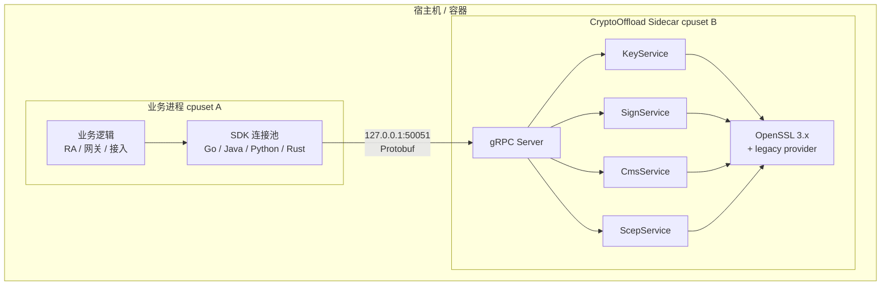
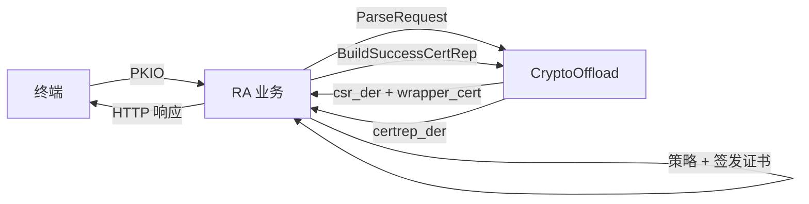
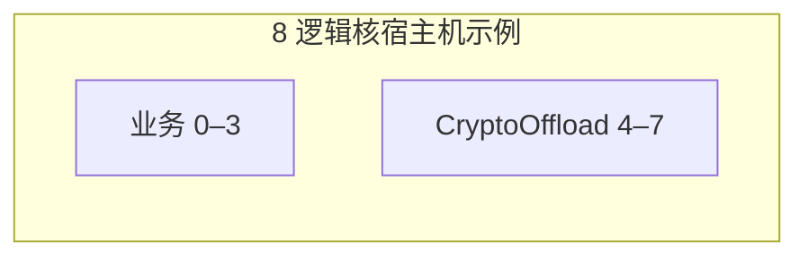

# CryptoOffloadService 方案与能力总览

> **面向宣讲 / 架构评审 / 运维 onboarding** 的项目级说明。  
> API 字段细节见 [API.md](./API.md)；压测数据见 [BENCHMARK_AND_TUNING.md](./BENCHMARK_AND_TUNING.md)。

---

## 1. 一句话定位

**CryptoOffloadService** 是一个以 **Rust + OpenSSL** 为核心的**密码运算 Sidecar**：业务进程（Go / Java / Python / Rust）通过 **gRPC + 连接池 SDK** 调用，把 RSA/EC/SM2/Ed25519 签名、CMS/PKCS#7、SCEP CertRep 等 **CPU 密集型** 运算从 JVM/Go 运行时中剥离，按 **`key_id`** 引用密钥，热路径不再搬运 PEM/DER。

---

## 2. 解决什么问题

| 痛点 | 传统做法 | CryptoOffload 做法 |
|------|----------|-------------------|
| Java/Go 里调 OpenSSL/BouncyCastle，GC 与 JNI 开销大 | 业务进程内嵌密码库 | 独立 Rust 进程，业务只传 `key_id` + 小包 |
| SCEP RA 路径复杂（PKIO 解析、3DES Envelop、CertRep） | 各语言重复实现 PKCS#7 | **ScepService** 统一 offload |
| 多语言产品线密码接口不一致 | 各写一套 | **Protobuf 契约** + 四语言 SDK |
| 密码运算与业务抢 CPU | 同进程争用 | **cpuset / Docker cpus** 隔离 Sidecar |
| JNI/内嵌库无法单独绑核 | OpenSSL 与 GC、HTTP 等同进程调度 | Sidecar **独占 CPU 核**，单核算力利用率大幅提升 |
| 密钥在热路径反复解析 PEM | 每次请求 decode ASN.1 | **ImportKey 一次解析**，内存缓存 `PKey` |

**适用场景**：IoT 证书签发（SCEP）、网关/CMS 签名、需要集中管控算法与 OpenSSL 版本的 PKCS#7 处理、国密 SM2 与 SCEP 组合 offload。

**不适用**：大包/流式（单字段 > 1 MiB）、需 HSM 硬件密钥、需磁盘持久化 KMS（本服务为**进程内内存**密钥库）。

---

## 3. 总体架构



**设计原则**

1. **密钥与运算分离**：ImportKey 在启动/轮换；Sign/CMS/SCEP 只传 `key_id`。
2. **协议标准化**：仅 gRPC/Protobuf（`cryptooffload.v1`），无自定义二进制帧。
3. **Sidecar 部署**：与业务进程同机不同 cpuset，可独立扩缩容与升级 OpenSSL。
4. **小包优先**：单字段 ≤ 1 MiB，面向 SCEP/CMS/签名等典型报文。

---

## 4. 四大服务能力

| 服务 | 能力 | 典型用途 |
|------|------|----------|
| **KeyService** | ImportKey / DeleteKey / GetKeyInfo / ListKeys | 类 KMS 的 `key_id` 管理；永久/临时密钥 |
| **SignService** | Sign / Verify | 通用数据签名；RSA / ECDSA / SM2 / Ed25519 |
| **CmsService** | Parse / Build / Verify | PKCS#7 解析、封装、验签 |
| **ScepService** | ParseRequest / Build*CertRep | RFC 8894 PKIO / CertRep 密码运算 |
| **ScepExtService** | ParseEnrollPkio / ParseGetCertPkio / CertAlias | 自定义 SCEP ASN.1 扩展（见 `docs/reference/scep/`） |

### 4.1 算法支持

| 类别 | 支持 |
|------|------|
| 摘要 | SHA-1 / SHA-256 / SHA-384 / SHA-512 / **SM3** |
| 签名 | RSA PKCS#1 v1.5、RSA-PSS、ECDSA、**SM2**、**Ed25519** |
| SCEP | 3DES EnvelopedData 解密/封装（需 legacy provider） |

### 4.2 SCEP 端到端（宣讲重点）



- **ParseRequest**：外层 SignedData 验签 + 内层 Envelop 解密 → `csr_der`、`wrapper_cert_der`
- **BuildSuccessCertRep**：pkiStatus=0，EnvelopedData 算法由 `envelope_cipher` 指定（默认 DES-CBC，与 smallstep 一致）
- **BuildFailureCertRep**：pkiStatus=2，无 Envelop，含 failInfo + failInfoText
- **BuildPendingCertRep**：pkiStatus=3，无 Envelop / failInfo，待人工审批
- **业务侧保留**：CSR 策略、审批、证书模板、HTTP/SCEP 协议层

详细时序图见 [API.md §1.3.3](./API.md#133-scep-证书签发scepservice)。

### 4.3 通用签名 / CMS

- **Sign**：ImportKey 一次 → 热路径 `Sign(key_id, data, …)`
- **CMS**：Build / Parse / Verify；支持 attached / detached
- 流程图见 [API.md §1.3.1–1.3.2](./API.md#13-集成流程一览)

---

## 5. 部署与资源模型



| 项 | 建议 |
|----|------|
| Sidecar CPU | 与业务 **cpuset 错开**；RSA/SCEP 密集场景约 2–4 核 |
| `--crypto-max-inflight` | = 可见核数 |
| SDK `MaxOpen` | **≈ 2 × server 核数**（见 §6.3） |
| 内存 | 密钥在进程内存；按导入密钥数量估算 |
| 启动参数 | `--worker-threads` / `--crypto-blocking-threads` 与核数对齐 |

Docker Compose 示例见 [BENCHMARK_AND_TUNING.md §4](./BENCHMARK_AND_TUNING.md#4-容器资源配置)。

---

## 6. 性能潜力（实测摘要）

**环境**：AMD Ryzen 7 5800X3D · WSL · RSA-2048 Sign · payload 256B  
**说明**：以下为 **已有 key_id 后的运算 QPS**，ImportKey 不计入。

### 6.1 绑核 vs 进程内 JNI（QPS/核）

**核心差异**：Java/Go 通过 JNI 或 BouncyCastle 在**业务进程内**做签名时，OpenSSL 与 GC、HTTP 线程、其它业务逻辑共享同一调度域，**无法**把密码运算单独绑到指定 CPU 核；运算线程在全机可见核上漂移，上下文切换与缓存失效多，**单核算力利用率低**。

CryptoOffload 作为**独立 Sidecar**，可用 `taskset` / Docker `cpuset` 为密码服务独占若干核，与业务进程 **cpuset 错开**，RSA 签名线程稳定跑在专用核上。

| 部署方式 | 绑核 | clients | Sign QPS | **QPS/核** | 说明 |
|----------|------|---------|----------|------------|------|
| 业务进程内 JNI（参考） | 不可单独绑核 | 4 | ~4326 | **~270** | 16 逻辑核混跑，总 QPS 尚可但单核效率低 |
| **Sidecar** cpuset 2 核 | 0–1 独占 | 4 | ~2534 | **~1267** | 仅 2 核即达混跑总吞吐的 ~59% |
| **Sidecar** cpuset 3 核 | 0–2 独占 | 6 | ~3749 | **~1250** | 3 核总吞吐接近 16 核混跑 |

**绑核后 QPS/核提升约 4.6×**（~270 → ~1250）。Sidecar 独占核场景下，加核近乎线性扩展（2 核 → 3 核，总 QPS +48%），可按需为密码运算分配 2–4 核而不影响业务 cpuset。

### 6.2 三核 Sidecar 各模式峰值（clients=4/6）

| 能力 | QPS | 特点 |
|------|-----|------|
| Sign (RSA) | ~3435–3750 | CPU 密集，绑核效果明显 |
| Verify / CMS parse | ~7000–8600 | 轻量，CPU 占用率偏低 |
| Ed25519 Sign | ~7600 | 软件实现极快 |
| SCEP ParseRequest | ~3334 | 含验签 + 3DES 解密 |
| SCEP CertRep Success | ~2608 | 含 Envelop，比 Failure 重 |
| SCEP Parse+Build | ~1536 | 完整 enrollment 路径 |

完整表格与复现命令见 [BENCHMARK_AND_TUNING.md §3](./BENCHMARK_AND_TUNING.md#3-参考性能必须标注环境)。

### 6.3 Client 连接池怎么配

网格压测结论（Sign 模式）：

| Server 核数 | **推荐 MaxOpen** | 说明 |
|------------|------------------|------|
| 2 | **4** | 再增大 clients，P99 恶化、QPS 几乎不升 |
| 3 | **6** | 约为 clients=8 峰值的 97%，P99 更优 |
| 4 | **8** | 经验公式：**MaxOpen ≈ 2 × 核数** |

脚本：`bash scripts/benchmark/run_client_grid.sh`

---

## 7. 稳定性与运维要点

| 机制 | 说明 |
|------|------|
| 入参上限 | 单字段 1 MiB，防 OOM |
| crypto Semaphore | 限制 OpenSSL 并发 ≈ 核数，防 blocking 任务堆积 |
| 锁 poison | 不再 panic 整进程，返回 UNAVAILABLE |
| 坏请求 | gRPC `INVALID_ARGUMENT`，进程继续服务 |
| 重启 | 密钥仅内存态，重启后业务 **重新 ImportKey** |

详见 [STABILITY.md](./STABILITY.md)。

---

## 8. 多语言接入

| 语言 | SDK | Demo |
|------|-----|------|
| Go | `sdk/go` | `examples/go/demo` |
| Java | `sdk/java` | `examples/java/Demo.java` |
| Python | `sdk/python` | `examples/python/demo.py` |
| Rust | `sdk/rust` | `examples/rust/demo.rs` |

**集成三步**

1. 启动 Sidecar（或 Docker Compose）
2. 启动/轮换时 `ImportKey` → 持久化 `key_id`（非 PEM）
3. 热路径调 Sign / CMS / SCEP RPC

Java 21 可用**虚拟线程** + blocking SDK，等待 offload 时不占满平台线程池（见 [API.md](./API.md) 集成说明）。

---

## 9. 能力边界（宣讲时建议主动说明）

| 项 | 边界 |
|----|------|
| 包大小 | 单字段 ≤ 1 MiB |
| 密钥存储 | 进程内存，**非**跨重启持久化 |
| HSM | 不支持；私钥经 ImportKey 进入内存 |
| 独立 Hash RPC | 无；摘要内置于 Sign |
| SM2 / SM3（国密） | 需 **OpenSSL 3.0+**（Provider 架构内置国密算法）；OpenSSL 1.1.x 不支持；部署前确认运行环境的 OpenSSL 版本与 default provider |
| SCEP Parse 压测 | PKIO fixture 压测时本地生成；生产用真实终端报文 |

---

## 10. 文档地图

| 文档 | 读者 | 内容 |
|------|------|------|
| **[OVERVIEW.md](./OVERVIEW.md)**（本文） | 架构师、产品、运维 | 方案、能力、性能、部署 |
| [API.md](./API.md) | 开发 | RPC 字段、流程图、示例代码 |
| [BENCHMARK_AND_TUNING.md](./BENCHMARK_AND_TUNING.md) | 运维、性能 | 压测、cpuset、clients 调优 |
| [TESTING.md](./TESTING.md) | 开发、QA | 单元 / 集成测试用例矩阵与运行方式 |
| [STABILITY.md](./STABILITY.md) | 运维、SRE | 加固措施与可选优化 |
| [README.md](../README.md) | 全员 | 快速开始、构建、测试 |

---

## 11. 版本与仓库

- **Proto 包**：`cryptooffload.v1`
- **默认端口**：`50051`
- **OpenSSL**：**3.0+**（推荐 3.x）；SCEP 3DES 需加载 **legacy provider**；**SM2/SM3 国密自 3.0 起可用**，1.1.x 不支持
- **当前版本**：0.2.2（`feature/scep-ext-v0.2` 分支；ScepExtService 扩展）

**快速验证**

```bash
# 测试
bash scripts/test/wsl_smoke_test.sh

# 3 核压测样例
bash scripts/benchmark/run_wsl_suite_3cpu.sh

# Client 网格调优
bash scripts/benchmark/run_client_grid.sh
```
