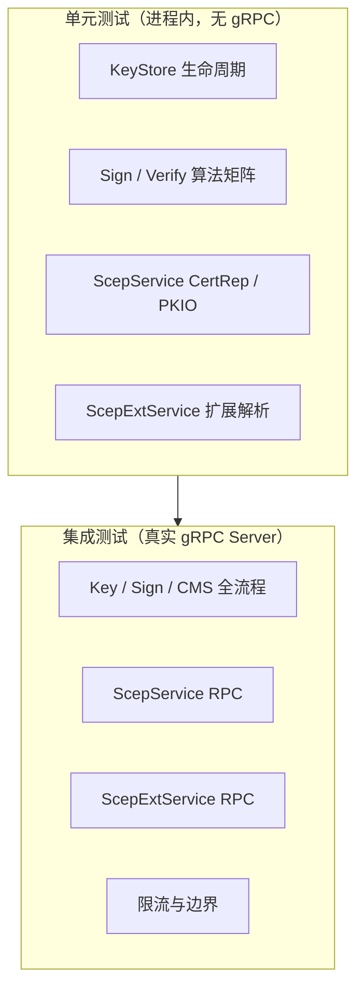

# 测试用例说明

本文档梳理 `crypto-offload-server` 的**单元测试**与 **gRPC 集成测试**覆盖范围，便于评审、回归与扩展用例时对照。

---

## 1. 如何运行

| 方式 | 命令 | 说明 |
|------|------|------|
| WSL 一键冒烟 | `bash scripts/test/wsl_smoke_test.sh` | 推荐；含 legacy provider 检查 |
| 全量 server 测试 | `cargo test -p crypto-offload-server` | 在 WSL/Linux 下执行 |
| 单套件 | `cargo test -p crypto-offload-server --test scep_tests` | 仅 SCEP 单元测试 |
| 单用例 | `cargo test -p crypto-offload-server scep_build_success_certrep_aes128_cbc` | 按函数名过滤 |

**环境要求**

- OpenSSL **3.x**，且加载 **legacy provider**（3DES EnvelopedData 依赖此项）。
- Debian bookworm 等需：`apt install openssl-provider-legacy`。
- SM2 相关用例在 OpenSSL 无国密支持时会 **skip** 或失败（视用例而定）。
- 若在 WSL 使用自编译 OpenSSL（如 `/opt/openssl30x`、`/opt/openssl35x`），请同时设置 `OPENSSL_DIR` / `OPENSSL_LIB_DIR` / `OPENSSL_INCLUDE_DIR` / `PKG_CONFIG_PATH` / `LD_LIBRARY_PATH`。

**测试文件位置**

| 文件 | 类型 | 用例数 |
|------|------|--------|
| `server/tests/key_store_tests.rs` | 单元 | 7 |
| `server/tests/sign_verify_tests.rs` | 单元 | 11 |
| `server/tests/scep_tests.rs` | 单元 | 14 |
| `server/tests/scep_ext_tests.rs` | 单元 | 5 |
| `server/tests/integration_test.rs` | 集成（gRPC） | 16 |
| **合计** | | **53** |

> 压测场景见 [BENCHMARK_AND_TUNING.md](./BENCHMARK_AND_TUNING.md)（`crypto-offload-benchmark` 二进制，非 `cargo test`）。

---

## 2. 覆盖维度总览

| 维度 | 单元测试 | 集成测试 |
|------|----------|----------|
| 密钥导入与生命周期 | ✓ | ✓ |
| 多算法 Sign / Verify | ✓ | ✓ |
| CMS 构建 / 解析 / 验签 | — | ✓ |
| SCEP PKIO 解析 | ✓ | ✓ |
| SCEP CertRep 构建（SUCCESS / FAILURE / PENDING） | ✓ | ✓ |
| EnvelopedData 多算法 | ✓ | ✓（主路径 0/1/2，其中 0=默认 AES-128） |
| 国密 GM CertRep（双证 + SKF） | ✓ | — |
| ScepExt Enroll / GetCert 解析 | ✓ | ✓ |
| CertAlias 编解码 | ✓ | — |
| 超大包拒绝 | — | ✓ |
| TEMPORARY 密钥一次性消费 | ✓ | ✓ |

---

## 3. KeyStore（`key_store_tests.rs`）

验证密钥**只解析一次**、`key_id` 引用、临时密钥销毁与基础 Sign/Verify。

| 用例 | 验证点 |
|------|--------|
| `import_pem_once_then_sign_without_reparse` | ImportKey 后多次 Sign 不重复 PEM 解析 |
| `temporary_key_consumed_after_first_use` | TEMPORARY 密钥首次密码运算后自动删除 |
| `sign_and_verify_roundtrip` | RSA PERMANENT 密钥 Sign → Verify 往返 |
| `hash_algorithms_sha384_sha512` | SHA-384 / SHA-512 哈希验签 |
| `delete_key_removes_from_store` | DeleteKey 后 key_id 不可用 |
| `sm2_sign_verify_roundtrip` | SM2 + SM3 往返（需 OpenSSL 国密） |
| `ed25519_sign_verify_roundtrip` | Ed25519 往返 |

---

## 4. Sign / Verify 算法矩阵（`sign_verify_tests.rs`）

直接调用 `crypto_sign`，覆盖**算法组合**与**非法参数拒绝**（不经过 gRPC）。

| 用例 | 密钥 | 签名算法 | 哈希 | 验证点 |
|------|------|----------|------|--------|
| `rsa_pkcs1_v15_sha256_roundtrip` | RSA-2048 | PKCS#1 v1.5 | SHA-256 | 标准路径 |
| `rsa_pkcs1_v15_sha384_sha512_verify_roundtrip` | RSA-2048 | PKCS#1 v1.5 | SHA-384 / SHA-512 | 多哈希验签 |
| `rsa_pkcs1_v15_sha1_roundtrip` | RSA-2048 | PKCS#1 v1.5 | SHA-1 | 兼容旧系统 |
| `rsa_pss_sha256_roundtrip` | RSA-2048 | RSA-PSS | SHA-256 | PSS 填充 |
| `rsa_inferred_algorithm_defaults_pkcs1_v15` | RSA-2048 | UNSPECIFIED | SHA-256 | 自动推断 PKCS#1 |
| `ecdsa_p256_sha256_roundtrip` | EC P-256 | ECDSA | SHA-256 | 椭圆曲线 |
| `ecdsa_rejects_ed25519_sign_algorithm` | EC P-256 | Ed25519（非法） | — | 参数校验 |
| `sm2_roundtrip` | SM2 | SM2 | SM3 | 国密 |
| `sm2_rejects_non_sm3_hash` | SM2 | SM2 | SHA-256（非法） | 国密哈希约束 |
| `ed25519_roundtrip` | Ed25519 | Ed25519 | UNSPECIFIED | 纯 Ed25519 |
| `ed25519_rejects_ecdsa_sign_algorithm` | Ed25519 | ECDSA（非法） | — | 参数校验 |

---

## 5. ScepService（`scep_tests.rs`）

直接调用 `crypto_scep` / `scep_certrep`，覆盖 RFC 8894 CertRep 与国密扩展。

### 5.1 PKIO 解析

| 用例 | 验证点 |
|------|--------|
| `scep_parse_request_3des_pkio` | 3DES EnvelopedData PKIO → `csr_der` + `wrapper_cert_der` 与 fixture 一致 |
| `scep_parse_request_password_pkio` | PasswordRecipientInfo PKIO + `challenge_password` → 明文 CSR |
| `scep_parse_then_build_success_3des_roundtrip` | ParseRequest → BuildSuccessCertRep（3DES Envelop）连贯路径 |
| `scep_password_envelope_roundtrip` | CMS pwri 加解密往返 |
| `scep_build_success_certrep_password_envelope` | `challenge_password` 构建 CertRep，内层为 pwri |

### 5.2 CertRep 状态码

| 用例 | pkiStatus | Envelop | 验证点 |
|------|-----------|---------|--------|
| `scep_build_failure_certrep` | 2 FAILURE | 无 | failInfo + failInfoText |
| `scep_build_pending_certrep` | 3 PENDING | 无 | 无 failInfo |

### 5.3 BuildSuccessCertRep — EnvelopedData 算法

与 `ScepEnvelopeCipher` 数值对齐；**0–2 为生产主路径**（其中 0 默认映射为 AES-128-CBC，6 表示禁用的 DES-CBC）。

| 用例 | `envelope_cipher` | 算法 | 场景 |
|------|-------------------|------|------|
| `scep_build_success_certrep_default_unspecified_to_aes128` | 1 | AES-128-CBC | 默认路径兼容（服务层 0→1） |
| `scep_build_success_certrep_aes128_cbc` | 1 | AES-128-CBC | RFC 8894 推荐 |
| `scep_build_success_certrep_aes256_cbc` | 2 | AES-256-CBC | step-ca 常用配置 |
| `scep_build_success_certrep` | 1 | AES-128-CBC | 通用 SUCCESS 冒烟 |
| `scep_build_success_certrep_extended_envelope_ciphers` | 3 / 4 / 5 | AES-GCM×2 + 3DES-CBC | 扩展互操作 |

### 5.4 BuildGmSuccessCertRep — 国密 Enroll SUCCESS

| 用例 | `envelope_cipher` | 外层 Envelop | 内层 |
|------|-------------------|--------------|------|
| `scep_build_gm_inner_signed_data_dual_cert_and_skf` | — | — | 双证 + SKF Base64 写入 eContent |
| `scep_build_gm_success_certrep_default_unspecified_to_aes128` | 1 | AES-128-CBC | 默认路径兼容（服务层 0→1） |
| `scep_build_gm_success_certrep_aes128_cbc` | 1 | AES-128-CBC | 双证 + SKF |
| `scep_build_gm_success_certrep_aes256_cbc` | 2 | AES-256-CBC | 双证 + SKF |
| `scep_build_gm_success_certrep_des3_envelope` | 5 | 3DES-CBC | 双证 + SKF（MDM 常见） |

---

## 6. ScepExtService（`scep_ext_tests.rs`）

SCEP 扩展：CertAlias 编解码、SignedAttributes 提取、Enroll / GetCert PKIO 一次 RPC 解析。

| 用例 | RPC / 模块 | 验证点 |
|------|------------|--------|
| `scep_ext_encode_decode_cert_alias` | Encode/DecodeCertAliasContent | Alias / CN 类型往返 |
| `scep_ext_encode_decode_serial_number` | Encode/DecodeCertAliasContent | 序列号十六进制往返 |
| `scep_ext_parse_signed_attributes_from_certrep` | ParseSignedAttributes | 从 CertRep 提取 transactionID / nonce |
| `scep_ext_parse_enroll_pkio` | ParseEnrollPkio | Envelop 解密 + CSR + wrapper + attrs |
| `scep_ext_parse_getcert_pkio` | ParseGetCertPkio | Envelop 解密 + CertAlias 内层 |

---

## 7. gRPC 集成测试（`integration_test.rs`）

启动真实 `run_server`，经 **tonic Client** 验证端到端路径。

### 7.1 基础服务

| 用例 | 服务 | 验证点 |
|------|------|--------|
| `grpc_import_sign_verify_cms_flow` | Key + Sign + CMS | ImportKey → Sign → Verify → CMS Build/Parse/Verify |
| `grpc_temporary_key_consumed` | Key + Sign | TEMPORARY 密钥 RPC 后不可再用 |
| `grpc_rejects_oversized_payload` | Sign | 超大 payload 返回 INVALID_ARGUMENT |
| `grpc_sign_verify_ed25519` | Sign | Ed25519 gRPC 往返 |
| `grpc_sign_verify_sm2` | Sign | SM2 gRPC 往返 |
| `grpc_sign_verify_rsa_pss` | Sign | RSA-PSS gRPC 往返 |

### 7.2 ScepService

| 用例 | RPC | 验证点 |
|------|-----|--------|
| `grpc_scep_parse_request` | ParseRequest | 3DES PKIO fixture → csr + wrapper |
| `grpc_scep_success_certrep` | BuildSuccessCertRep | 默认 AES-128-CBC SUCCESS CertRep 非空 |
| `grpc_scep_success_certrep_envelope_ciphers` | BuildSuccessCertRep | **0 / 1 / 2** 三种配置可构建（0 映射为 AES-128） |
| `grpc_scep_failure_certrep` | BuildFailureCertRep | FAILURE 非空 |
| `grpc_scep_pending_certrep` | BuildPendingCertRep | PENDING 非空 |
| `grpc_scep_certrep_verify` | BuildSuccessCertRep + CmsService.Verify | CertRep CMS 结构可被 CA 证书验签 |

### 7.3 ScepExtService

| 用例 | RPC | 验证点 |
|------|-----|--------|
| `grpc_scep_ext_parse_enroll_pkio` | ParseEnrollPkio | Enroll PKIO → CSR + attrs + wrapper |
| `grpc_scep_ext_parse_getcert_pkio` | ParseGetCertPkio | GetCert PKIO → CertAlias + wrapper |

### 7.4 CmpService（OpenSSL 3.x 路径）

| 用例 | RPC | 验证点 |
|------|-----|--------|
| `grpc_cmp_build_succeeds_or_reports_unsupported` | BuildProtectedPkiMessage | OpenSSL 支持时可构建受保护 PKIMessage；不支持时返回 `FAILED_PRECONDITION` |
| `grpc_cmp_parse_and_verify_validates_required_fields` | ParseAndVerifyPkiMessage | 单 RPC Parse+Verify 路径的参数校验（`verify_key_id` 必填） |
| `grpc_cmp_build_invalid_der_reports_invalid_argument_or_unsupported` | BuildProtectedPkiMessage | 非法 DER 入参返回 `INVALID_ARGUMENT`；若环境不支持 CMP 则返回 `FAILED_PRECONDITION` |

> CMP Build 路径当前采用 **C shim + OpenSSL ASN.1** 组包，重点回归 `grpc_cmp_build_succeeds_or_reports_unsupported`。

### 7.5 运行时保护（v0.2.4）

| 用例 | 类型 | 验证点 |
|------|------|--------|
| `run_crypto_rejects_when_overload_watermark_reached` | 单元 | 触发并发水位后返回 `RESOURCE_EXHAUSTED` |
| `run_crypto_times_out_on_long_blocking_task` | 单元 | 长耗时任务超时返回 `DEADLINE_EXCEEDED` |

---

## 8. 与 Benchmark 的关系

| 类型 | 工具 | 目的 |
|------|------|------|
| 单元 / 集成测试 | `cargo test` | **正确性**、回归、CI |
| 压测 | `crypto-offload-benchmark` | **吞吐 / 延迟**（QPS、P50/P99） |

SCEP SUCCESS CertRep 压测 mode 与单元测试 Envelop 算法对应关系：

| Benchmark mode | `envelope_cipher` | 对应单元测试 |
|----------------|-------------------|--------------|
| `scep-certrep-success` | 0（UNSPECIFIED→AES-128） | `scep_build_success_certrep_default_unspecified_to_aes128` |
| `scep-certrep-success-aes128-cbc` | 1 | `scep_build_success_certrep_aes128_cbc` |
| `scep-certrep-success-aes256-cbc` | 2 | `scep_build_success_certrep_aes256_cbc` |

---

## 9. 已知缺口（有意未覆盖或待补充）

| 项 | 说明 |
|----|------|
| GM CertRep gRPC 集成 | 国密 SUCCESS 仅有单元测试，尚无 `grpc_build_gm_success_cert_rep` |
| GCM Envelop gRPC | AES-GCM（3/4）仅有单元测试 |
| SM2 CA 签 CertRep | SM2 CA 自动 SM3 签名路径依赖 OpenSSL 国密环境 |
| 端到端 SCEP HTTP | HTTP/MIME 由 Go SCEP 负责，不在本服务测试范围 |
| 真实 Apple / MDM 样例 DER | 无外部设备抓包 golden 文件 |

扩展用例时建议：先在本表对应章节补一行，再实现测试并保持 **单元 → 集成 → benchmark** 三层一致。
